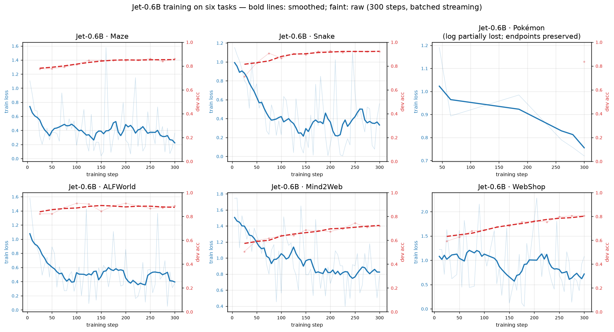

[English](README.md) · [简体中文](README.zh-CN.md)

# Jeτ: Introducing System One Models for Long-Horizon Decision-Making

## 01 From Language Generation to Structured Decisions

[Jev](https://typesafe.ai/blog/introducing-system-one-models-and-jev) has brought a familiar but often overlooked moment into focus: the instant software must choose. Which element should a browser click? Which tool should receive a task? Which move should an agent make in a game? The answer may be a single option, yet moments like these recur throughout an interaction.

Large language models have given machines a remarkable command of language. Software often borrows that ability to make decisions: describe the situation, wait for a written answer, then extract an action from the text. Over a short task, this feels natural. As the number of steps grows, the time spent generating and interpreting each answer grows with it.

Jev makes the decision itself the model's output. As a **System One Model**, it takes a state and a well-defined question, then returns a structured choice and its probability. Software can act on that choice immediately and move to the next step. See the [TypeSafe model documentation](https://docs.typesafe.ai/introduction).

The environment changes; another state arrives. In this loop, Jev serves as a **decision model** whose judgments can keep pace with games, control systems, and software workflows.

## 02 When Decisions Begin to Depend on Each Other

As an interaction continues, the past begins to shape the present. One choice changes the environment and leaves information for the next. What the model sees now is only one part of the journey.

Imagine a maze that reveals only the area around you. At a fork, two paths may look equally promising. If the left path has already led to a dead end, that experience should travel back with the decision model. When it reaches a similar fork again, the route it has taken should still matter.

A battle unfolds the same way. How an opponent responded to the last move, and which moves have already failed, can shape the next turn. Looking only at the current screen invites the same mistake twice.

Consider a series of stock decisions. A price rise today means something different if a purchase was already made yesterday. Earlier actions and their outcomes change what the next action should be, even when the signal on today's screen looks the same.

Mazes, battles, and markets share a temporal demand: each decision must pick up where the previous one left off. For a decision model such as Jev, a long-horizon task calls for **state that persists and evolves across decisions**.

## 03 Jeτ: A System One Model for Long-Horizon Decisions

We introduce **Jeτ**, the first stateful System One Model designed for long-horizon decision-making. It carries forward Jev's clear, fast way of choosing while bringing earlier observations, actions, and outcomes into the next decision.

In a maze, Jeτ can continue along a route it has already explored. In a battle, the next turn can draw on the exchange that came before it. Across a sequence of stock decisions, whether it bought yesterday can inform what it does today.

The same scene can call for a different move when the journey to that scene has changed. Jeτ lets a decision model act with its experience still in view, so each choice belongs to a longer course of action.

**Jeτ brings System One Models into the era of long-horizon decisions.**

## 04 A Long History, Held in Latent Space

A single decision can be brief even when the task lasts a long time. Every fork in a maze and every probe in a battle adds to the trajectory. Reading the entire record again at every step eventually runs into context limits and the cost of repeatedly processing the past. Long-horizon decisions need an internal state that can travel with the task while remaining compact.

We call this **Persistent Latent State**. Interaction history settles into a set of continuous representations inside the model, where it can inform the next choice. At a maze junction, the model need not reread its full route to carry forward the fact that the path on the left ended in a wall.

The state has a concrete computational form. Learnable continuous state embeddings read what has happened so far and produce key-value representations across the model's attention layers. These representations remain in the decision cache as a shared latent context for future candidates. When Jeτ weighs “left” against “right,” attention can reach that context directly.

The trajectory can keep growing while the state stays within a fixed capacity. Earlier textual steps are compressed and leave the current context; new experiences continue to enter the state. In principle, Jeτ can therefore run through an arbitrarily long sequence of interactions while reading a compact account of its past at each step. The design follows Jev's System One philosophy: keep the immediate choice fast and structured, and let the experience behind it persist internally.

A persistent state matters only if it can change with the task. We therefore introduce **Latent-State Recurrence (LSR)**. The existing state $s_k$ receives a recent segment of interaction $\tau_k$ and becomes the next state:

$$
s_{k+1}=\mathrm{LSR}(s_k,\tau_k).
$$

Jeτ first holds recent observations, actions, and feedback in a short working window. At a write point, state embeddings pass through the model alongside the previous state and the recent interaction, producing new latent representations across its layers. The raw steps then leave the cache, while the updated state remains. The next set of candidate actions reads that state directly. New experience arrives; the previous state helps shape its successor; the successor carries the history forward.

Suppose the model takes the left branch of a maze, finds a dead end, and returns. That experience is written into state. At the original fork, the candidates are still “left” and “right,” but the internal state behind the choice has changed. Each new junction can then build on what the model has already explored.

**Persistent Latent State** keeps experience inside the decision model. **LSR** carries it across successive choices. Jev gives each step a fast, explicit answer; Jeτ lets those answers advance along one continuous task.

## 05 Jeτ-0.6B: From Language Model to Decision Model

The measure of a state is whether it helps the next decision. To bring latent state into the decision process, we built **Jeτ-0.6B** on a Qwen3-0.6B language backbone. We give candidate actions a structured scoring interface, then extend that interface across a continuous trajectory of interaction.

Qwen originally generates an answer by predicting the next token. To turn it into a Jev-style decision model, we retain the pretrained backbone's understanding of the situation and score a **set of candidate actions** directly. Each example supplies a current state, a specific question, and actions the model can take. The state and question form a shared context. Each candidate follows its own branch through Qwen; the hidden representation at the end of that branch enters a decision head and receives a score. The head also lets candidates exchange information, so each score reflects the alternatives available in the same situation.

At a maze fork, for example, the model receives its local view and the candidates “left” and “right.” It compares their scores and selects the next move. Normalizing the scores also yields a probability over actions. The result is an executable choice, made directly from Qwen's understanding of the scene.

Time enters through the same interface. Jeτ keeps Persistent Latent State in Qwen's attention path: every candidate score can read the representations left by earlier steps, and each new segment of interaction updates them. The structured decision remains clear, while a trajectory of state develops inside the model.

For training, we organize multi-step tasks into continuous **episodes**. At step $t$, the environment supplies an observation $o_t$ and a candidate set $\mathcal A_t$. The decision model selects an action $a_t$ and receives feedback $f_t$. Exploring a maze, testing a move in battle, and carrying out a sequence of software actions all fit this form.

Jeτ trains along the trajectory. It scores candidates in the current context, receives feedback, and updates latent state at write boundaries. With the target action $a_t^*$ at each step as supervision, the objective is:

$$
\mathcal L_{\mathrm{decision}}
=-\frac{1}{T}\sum_{t=1}^{T}
\log p_\theta(a_t^*\mid c_t,\mathcal A_t).
$$

Here $c_t$ includes the current observation, recent interaction, and Persistent Latent State. The loss trains the Qwen backbone and decision head to choose well at each step. State is written and read repeatedly along the same episode, so a detail preserved now can matter to a later choice. After a dead end, the useful thing to retain is the clue that changes direction at the next fork. Reading and writing learn around that future decision.

Jeτ-0.6B now has a complete long-horizon decision loop: understand the scene, choose an action, receive its outcome, update state, and move on with that state intact.

## 06 Behind Every Choice

Jeτ enters six different tasks with a Persistent Latent State. At each step, it chooses from a set of available actions.



*Figure 1 | Jeτ-0.6B training curves across six tasks*

We compare it with two settings of [NanoJev](https://github.com/TianyuCodings/NanoJev): **Observation Only**, which sees the current scene, and **Text History**, which receives a recent transcript along with the scene. Neither baseline has been trained on these tasks.

**Step accuracy** is the share of decision points at which the model chooses the target action, pooled over all test episodes. A wrong turn does not erase the other choices made correctly in the same episode.

| Setting | Task | Observation Only | Text History | Jeτ |
|---|---|---:|---:|---:|
| Game | Maze navigation | 39.2% | 37.4% | **83.2%** |
| Game | Snake | 55.3% | 35.1% | **91.0%** |
| Game | Pokémon battle | 31.0% | 26.0% | **79.6%** |
| Decision | Household tasks ([ALFWorld](https://arxiv.org/abs/2010.03768)) | 18.0% | 40.2% | **86.9%** |
| Decision | Web interaction ([Mind2Web](https://arxiv.org/abs/2306.06070)) | 13.2% | 13.3% | **63.1%** |
| Decision | Online shopping ([WebShop](https://arxiv.org/abs/2207.01206)) | 45.1% | 46.8% | **82.3%** |

Each game probes a different relationship with the past. The maze hides paths the model has already traveled. Snake keeps the whole board in view. Pokémon carries choices across turns. Jeτ leads on step accuracy in all six tasks. The next test is whether those choices can add up to a completed journey.

## 07 From the Maze to Practical Tasks

Choosing one step correctly is still some distance from reaching the goal. A maze has to be navigated fork by fork; a household task has to be carried through finding, preparing, and placing an object. We let Jeτ act from the start of each task to its end. For this comparison, the **Observation Only** version of NanoJev receives the same task training as Jeτ.

| Task | Final outcome | Observation Only | Jeτ |
|---|---|---:|---:|
| Maze navigation | Completion rate | 11.7% | **80.0%** |
| Snake | Completion rate | 92.0% | 88.0% |
| Pokémon battle | Win rate | 53.0% | 48.0% |
| Household tasks (ALFWorld) | Completion rate | 45.5% | **76.1%** |
| Online shopping (WebShop) | Mean reward | 0.680 | 0.675 |

The **maze** makes the effect of state visible. The model sees only a small area around itself and has 64 moves to reach the goal. Observation Only completes **11.7%** of episodes. Jeτ completes **80.0%**, taking an average of just **15.1 steps** in successful runs. Explored paths no longer vanish when they leave the screen; exploration turns into a route toward the goal.

The history does not slow the next choice. In one maze run, Jeτ and Text History both reach the goal along the 14-step shortest path. Jeτ takes a median of **65 ms per step**, compared with **590 ms** for Text History. Fast choices can continue all the way down the route.

Beyond the maze, continuous action begins to look more familiar. Across **134 unseen ALFWorld tasks**, the model must find an object, clean or heat it as requested, and place it where it belongs. Jeτ completes **76.1%** of these tasks, compared with **45.5%** for Observation Only. Progress made in one step remains available to guide the next.

Web tasks bring changing interfaces into the loop. In **Mind2Web**, the model locates and acts on target elements across pages; Jeτ selects the correct element at **63.1%** of decision points. This benchmark is scored at the level of individual web actions.

In **WebShop**, the model searches, browses, and ultimately purchases a product, usually within a handful of steps. Jeτ's mean reward is close to Observation Only; the two also remain close on full-task Snake and Pokémon results. When the current view already carries the information a decision needs, choices remain lightweight. When a crucial clue lives in the past, Persistent Latent State brings it into the next step and extends System One decisions across a longer task.

## 08 Quick Start

The repository includes episode data for all six tasks, along with training and evaluation entry points. The maze offers a short path through the code: start from a base decision model, train Jeτ with Persistent Latent State, then let it navigate on its own. The commands below assume Linux and a CUDA GPU with BF16 support.

```bash
python -m venv .venv
source .venv/bin/activate
python -m pip install -r requirements.txt
```

Place a compatible [NanoJev](https://github.com/TianyuCodings/NanoJev) decision-model bundle at `checkpoints/NanoJev-unified/`. It should contain `config.json`, `best.safetensors`, `tokenizer/`, and `backbone_config/`. Model weights are not committed to this repository.

```bash
python -m jet.train_jet_bs \
  --task maze \
  --train data/maze/train.jsonl \
  --dev data/maze/dev.jsonl \
  --checkpoint checkpoints/NanoJev-unified \
  --out checkpoints/jet/jet06_maze \
  --steps 300 --eval-every 25 --eval-episodes 24 \
  --note-window 6 --note-slots 16 --note-cap 4 \
  --max-train-steps 20 --mem-fraction 0.9
```

The trained Jeτ bundle is saved in `checkpoints/jet/jet06_maze/`. Run a closed-loop evaluation to see whether it reaches the goal before its move budget expires:

```bash
python -m jet.eval_games_closed \
  --task maze --policy jet \
  --checkpoint checkpoints/jet/jet06_maze \
  --model-name jet06_maze \
  --episodes 60 \
  --out results/closed/maze_jet06.json
```

The output reports completion rate and steps to the goal. If you already have a trained Jeτ bundle, you can go straight to evaluation. Snake and Pokémon use the same game evaluator; entry points for the remaining tasks are `jet/eval_alfworld_closed.py`, `jet/eval_mem.py`, and `jet/eval_webshop_closed.py`.

## 09 System One Meets the Long Horizon

Jev made a model's judgment an explicit choice that software can act on immediately. Jeτ carries that idea forward. Each choice leaves a trace in state. When the next scene arrives, the decision model picks up where it left off.

The difference grows with the task. A dead end in a maze, a completed step in a household workflow: each can change what should happen next. Jeτ folds those experiences into an evolving latent state, giving fast local choices a direction that lasts across the entire task.

Agents are taking on longer, more open-ended courses of action. Environments keep changing; goals unfold over many steps; past choices shape what is possible next. A System One Model built for this world needs both the speed to choose now and a way to carry its history forward. Jeτ opens that path: a long-horizon decision model that can learn what to retain and how to keep moving.

**From the next step to the journey ahead.**

## Acknowledgments

Jeτ continues the System One line of inquiry opened by Jev. We thank [TianyuCodings](https://github.com/TianyuCodings) and the contributors to [NanoJev](https://github.com/TianyuCodings/NanoJev) for sharing their model and code. Their work gave this research an important starting point.

We are also grateful to everyone who shares code, data, models, and ideas. Progress on long-horizon decisions rests on that collective work.

## Copyright and License

© 2026 Jet authors. Jeτ's original code and documentation are licensed under [PolyForm Noncommercial 1.0.0](LICENSE). Noncommercial research, study, modification, and sharing are permitted; commercial use requires separate authorization.

If you publish this project or derivative code built on Jeτ, retain the copyright and license notices and clearly credit **[Jeτ (Jetau)](https://github.com/Nomothings/Jet)** and its source in your project documentation. Vendored NanoJev code remains under its [original MIT license](jet/vendor/LICENSE). Third-party model weights and datasets remain subject to their own terms.
